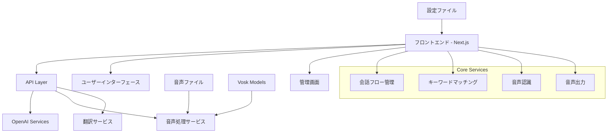
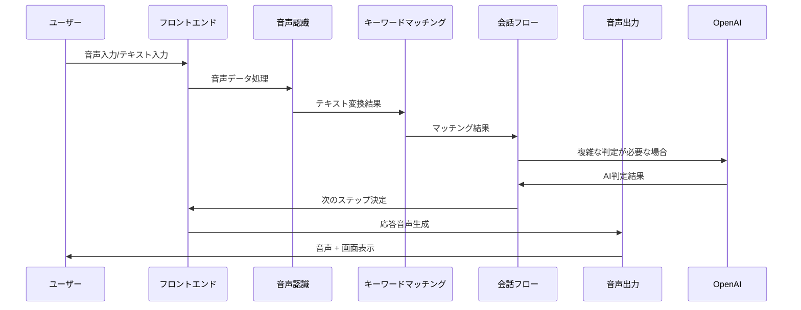

# AI Chatbot Banking Assistant - アプリケーション概要

## 📋 アプリケーション概要

このアプリケーションは、銀行のATMサービスをサポートする多言語対応のAIチャットボットシステムです。音声入出力機能を備え、顧客との自然な対話を通じて銀行業務をサポートします。

## 🎯 主要機能

### 1. 多言語対応
- **日本語・英語**の完全サポート
- リアルタイム言語切り替え
- 文脈を理解した翻訳機能

### 2. 音声インタラクション
- **音声認識**：ユーザーの発話を理解
- **音声合成**：事前録音された音声ファイル + TTS
- **オフライン対応**：Vosk音声認識エンジン

### 3. 動的会話フロー
- JSON設定ベースの会話管理
- OpenAI powered インテリジェント応答
- リアルタイム設定更新

### 4. アクセシビリティ
- **高コントラストモード**
- **大文字表示機能**
- **完全音声ナビゲーション**

### 5. 管理機能
- コンテンツ管理システム
- 音声ファイル生成・管理
- フロー可視化
- 設定管理

## 🏗️ システム構成



## 🔄 処理の流れ

### ユーザー操作フロー
1. **言語選択** → システム言語設定
2. **音声入力/テキスト入力** → 音声認識処理
3. **キーワードマッチング** → 意図理解
4. **フロー判定** → 次のステップ決定
5. **応答生成** → 音声出力 + 画面表示
6. **状態更新** → 会話履歴管理

### 設定更新フロー
1. **設定ファイル読み込み** → configuration.json
2. **OpenAI変換** → 最適化された会話フロー
3. **キャッシュ更新** → メモリ内フロー更新
4. **リアルタイム反映** → 5秒間隔での自動更新

## 🛠️ 使用技術

### フロントエンド
- **Next.js 15.3.3** - React フレームワーク
- **TypeScript 5** - 型安全な開発
- **Tailwind CSS 4** - ユーティリティファーストCSS
- **React 19** - 最新のReact機能

### バックエンド・API
- **Next.js API Routes** - サーバーサイド処理
- **OpenAI GPT-4/3.5** - AI理解・翻訳
- **Axios** - HTTP通信

### 音声処理
- **Vosk Browser** - オフライン音声認識
- **Web Speech API** - ブラウザ音声認識
- **Web Audio API** - 音声再生制御
- **VOICEVOX** - 日本語音声合成

### データ管理
- **JSON設定ファイル** - 動的フロー管理
- **ローカルストレージ** - 設定保存
- **メモリキャッシュ** - パフォーマンス最適化

### 開発・品質管理
- **ESLint** - コード品質
- **TypeScript** - 型チェック
- **Responsive Design** - マルチデバイス対応

## 📊 データフロー図



## 🎨 ユーザーインターフェース構成

### メイン画面
- **スタート画面** - ウェルカムメッセージ
- **言語選択** - 日本語/英語選択
- **チャット画面** - メイン会話インターフェース

### 管理画面
- **コンテンツプレビュー** - フロー確認・テスト
- **コンテンツ編集** - 会話内容編集
- **設定管理** - システム設定

### アクセシビリティ機能
- **設定ボタン** - 文字サイズ・コントラスト調整
- **音声ナビゲーション** - 完全音声操作
- **レスポンシブデザイン** - スマートフォン対応

## 🔧 開発環境設定

### 必要な環境変数
```bash
# OpenAI API設定
OPENAI_API_KEY=your_openai_api_key
NEXT_PUBLIC_OPENAI_API_KEY=your_openai_api_key

# 音声ファイル設定
VOICEVOX_SERVER_URL=http://localhost:50021
```

### 必要なファイル
```
/public
├── audio/              # 音声ファイル
│   ├── ja/            # 日本語音声
│   └── en/            # 英語音声
├── models/            # Vosk音声認識モデル
└── configuration.json # メイン設定ファイル
```

## 📈 パフォーマンス特性

### 応答性能
- **音声認識**: 500ms以内で開始
- **テキスト処理**: 100ms以内でマッチング
- **画面更新**: 即座に反映

### スケーラビリティ
- **設定更新**: リアルタイム反映
- **多言語拡張**: 設定ファイルで対応
- **音声拡張**: 話者追加可能

### 信頼性
- **オフライン対応**: 基本機能は継続動作
- **フォールバック**: 複数の代替手段
- **エラーハンドリング**: 詳細なエラー対応

この概要文書は、システムの全体像を理解するための出発点として活用してください。詳細な技術仕様については、各コンポーネントの詳細文書を参照してください。