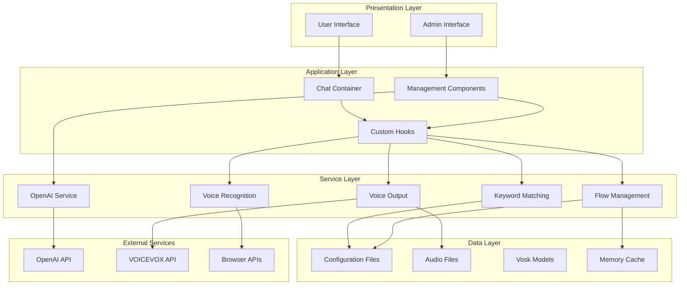
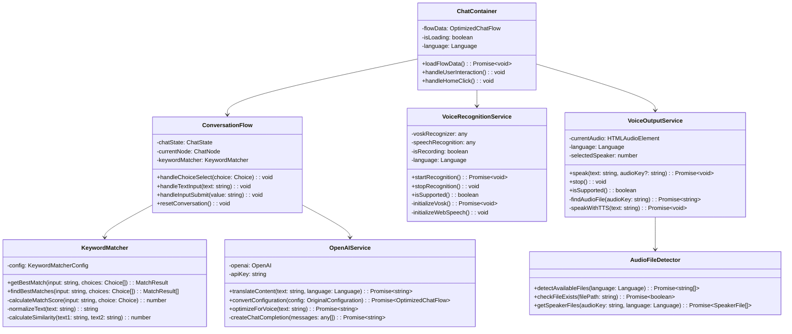
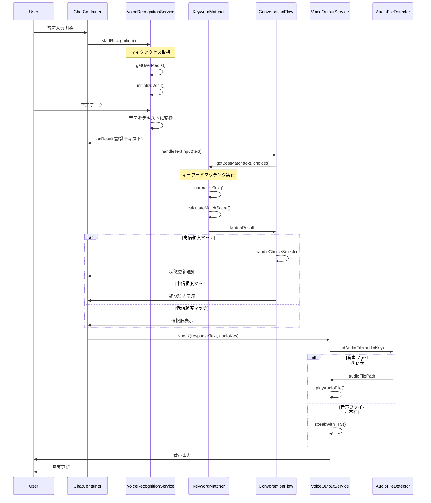
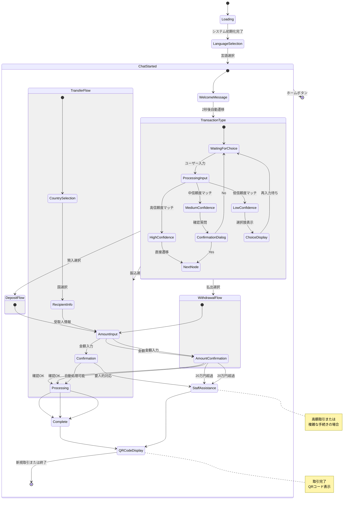
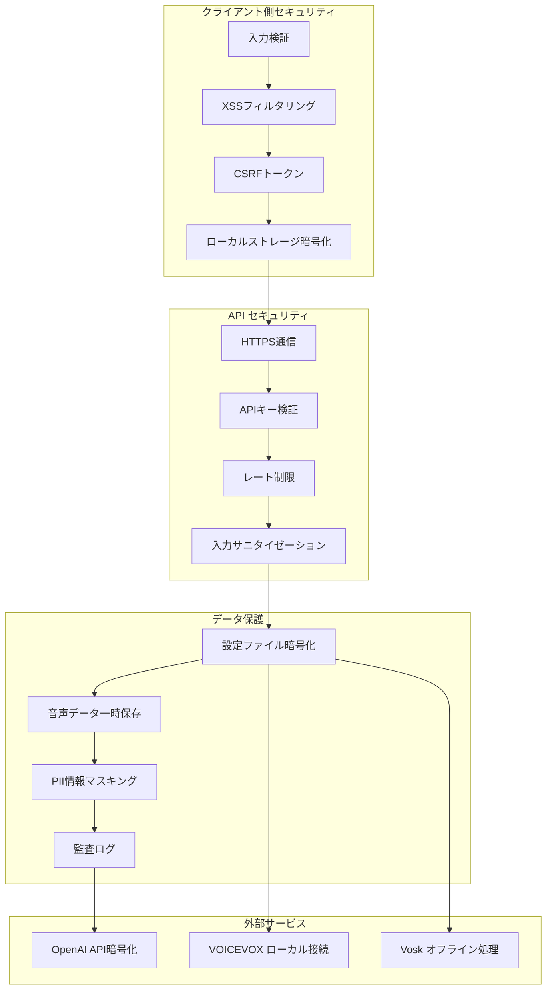
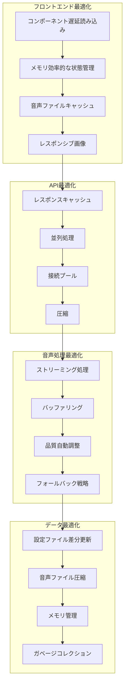
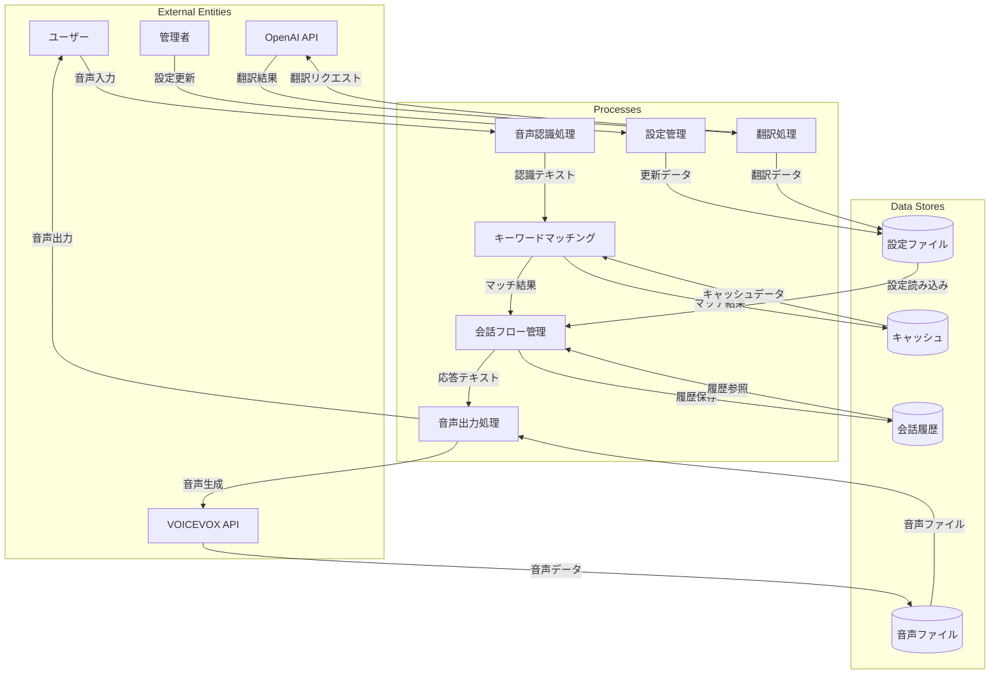
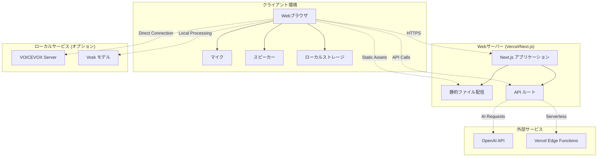

# システム設計書 - UML図とアーキテクチャ

## 🏗️ システム全体アーキテクチャ

### レイヤードアーキテクチャ図



## 📋 クラス図 (UML Class Diagram)



## 🔄 シーケンス図 - ユーザー音声入力処理



## 🔧 コンポーネント図 - システム構成要素

```mermaid
graph TD
    subgraph "Frontend Application"
        subgraph "Pages"
            MainApp[Main Application]
            ManagementPage[Management Page]
        end
        
        subgraph "Chat Components"
            ChatContainer[Chat Container]
            MessageBubble[Message Bubble]
            ChoiceButtons[Choice Buttons]
            InputField[Input Field]
            QRDisplay[QR Code Display]
        end
        
        subgraph "Management Components"
            ContentPreview[Content Preview]
            ContentManager[Content Manager]
            FlowVisualization[Flow Visualization]
            SpeakerSelector[Speaker Selector]
        end
        
        subgraph "UI Components"
            LanguageSelector[Language Selector]
            SettingsButton[Settings Button]
            ApiKeySettings[API Key Settings]
        end
    end
    
    subgraph "Custom Hooks"
        ConversationFlowHook[useConversationFlow]
        VoiceHook[useVoice]
    end
    
    subgraph "Services"
        VoiceRecognitionSvc[Voice Recognition]
        VoiceOutputSvc[Voice Output]
        KeywordMatchingSvc[Keyword Matching]
        OpenAISvc[OpenAI Service]
    end
    
    subgraph "Utilities"
        FlowConverter[Flow Converter]
        AudioDetector[Audio File Detector]
        ResponseStrategy[Response Strategy]
    end
    
    subgraph "API Routes"
        ConvertJsonAPI[/api/convert-json]
        SaveAudioAPI[/api/save-audio]
        TranslateAPI[/api/translate]
        OpenAIAPI[/api/openai/*]
    end
    
    MainApp --> ChatContainer
    ManagementPage --> ContentPreview
    ManagementPage --> ContentManager
    
    ChatContainer --> ConversationFlowHook
    ChatContainer --> VoiceHook
    ChatContainer --> MessageBubble
    ChatContainer --> ChoiceButtons
    
    ConversationFlowHook --> KeywordMatchingSvc
    VoiceHook --> VoiceRecognitionSvc
    VoiceHook --> VoiceOutputSvc
    
    VoiceOutputSvc --> AudioDetector
    KeywordMatchingSvc --> ResponseStrategy
    
    ContentManager --> OpenAISvc
    OpenAISvc --> OpenAIAPI
    FlowConverter --> ConvertJsonAPI
```

## 📊 状態遷移図 - 会話フロー管理



## 🎯 ユースケース図

```mermaid
graph LR
    subgraph "利用者"
        Customer[顧客]
        Admin[管理者]
    end
    
    subgraph "システム機能"
        subgraph "顧客向け機能"
            UC1[言語選択]
            UC2[音声対話]
            UC3[取引選択]
            UC4[金額入力]
            UC5[取引確認]
            UC6[QRコード受取]
        end
        
        subgraph "管理者向け機能"
            UC7[コンテンツ管理]
            UC8[音声ファイル生成]
            UC9[フロー編集]
            UC10[設定管理]
            UC11[プレビュー機能]
        end
        
        subgraph "システム機能"
            UC12[音声認識]
            UC13[キーワードマッチング]
            UC14[AI翻訳]
            UC15[フロー自動更新]
        end
    end
    
    Customer --> UC1
    Customer --> UC2
    Customer --> UC3
    Customer --> UC4
    Customer --> UC5
    Customer --> UC6
    
    Admin --> UC7
    Admin --> UC8
    Admin --> UC9
    Admin --> UC10
    Admin --> UC11
    
    UC2 --> UC12
    UC2 --> UC13
    UC7 --> UC14
    UC9 --> UC15
    
    UC12 -.-> UC13 : includes
    UC8 -.-> UC14 : includes
    UC9 -.-> UC15 : includes
```

## 🔐 セキュリティ設計図



## 📈 パフォーマンス設計図



## 🔄 データフロー図 (DFD)



## 📐 配置図 (Deployment Diagram)



これらのUML図とアーキテクチャ図により、システムの設計と構造を包括的に理解できます。各図は異なる視点からシステムを表現し、開発者が全体像を把握しやすくなっています。